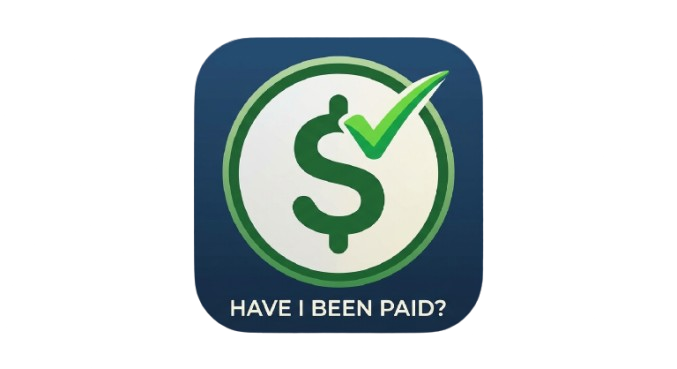
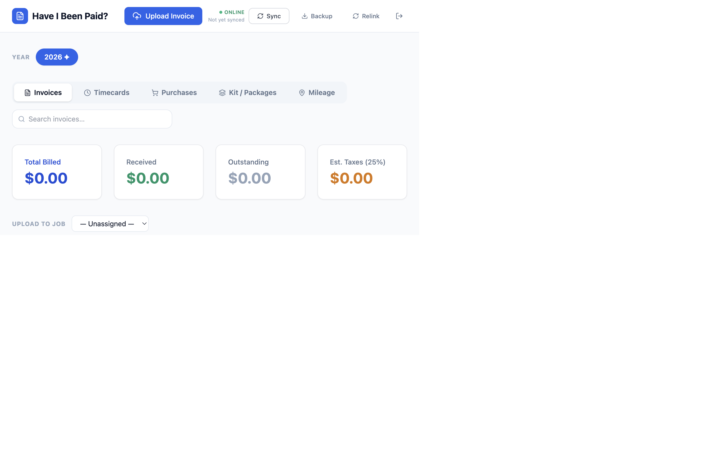
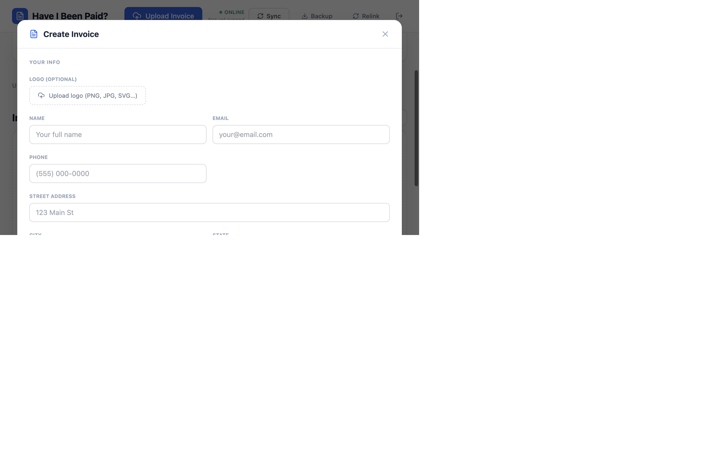
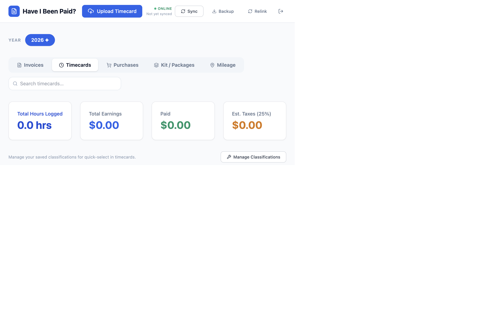
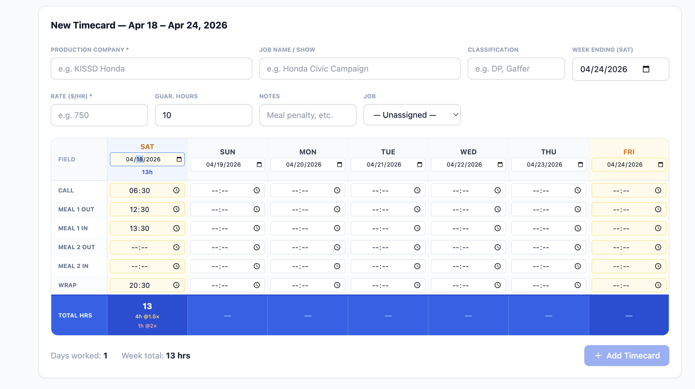
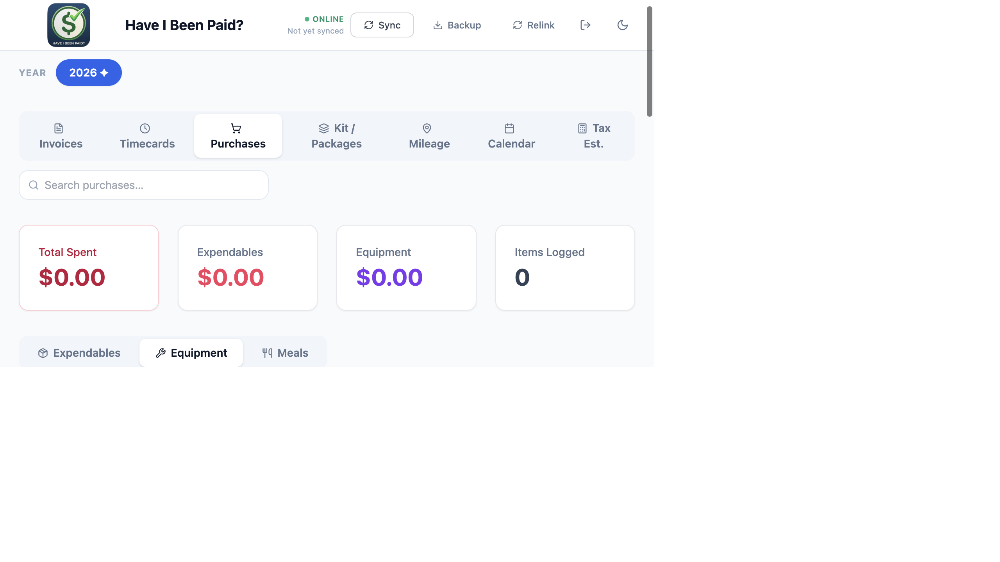
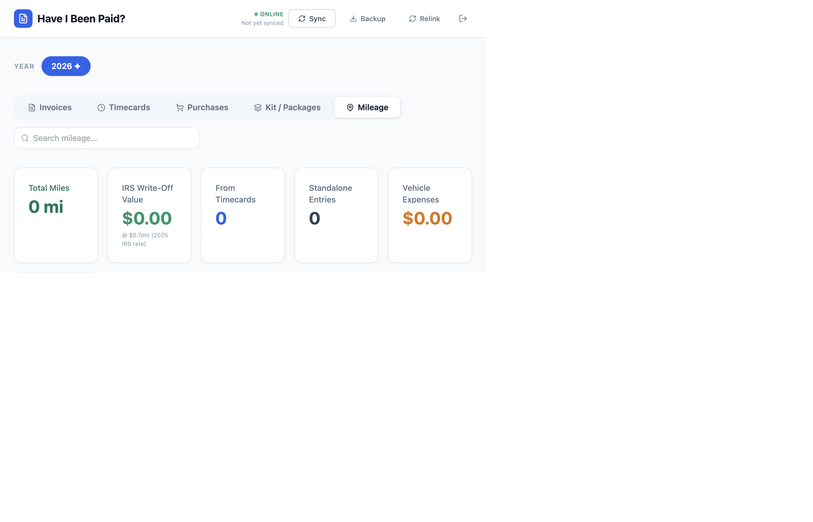

<p align="center">
  
</p>

<h1 align="center">Have I Been Paid?</h1>

<p align="center">
  A modern, full-featured financial tracking app for freelancers, contractors, and gig workers.<br/>
  Track invoices, timecards, expenses, mileage, kit rentals, and production schedules — all in one place.
</p>

<p align="center">
  <a href="https://github.com/rmendoza050288-coder/have-i-been-paid/releases/latest">
    
  </a>
  &nbsp;
  
  &nbsp;
  
</p>

---

## Screenshots

### Invoices Dashboard


### Create Invoice (with Logo Upload)


### Timecards Dashboard


### Timecard Entry Form


### Purchases & Equipment


### Mileage & Vehicle Expenses


---

## Download

| Platform | Link |
|----------|------|
| macOS (Universal — Apple Silicon + Intel) | [Have I Been Paid-1.5.0-universal.dmg](https://github.com/rmendoza050288-coder/have-i-been-paid/releases/latest) |
| Windows (x64) | [Have I Been Paid Setup 1.5.0.exe](https://github.com/rmendoza050288-coder/have-i-been-paid/releases/latest) |

---

## Features

### 📋 Invoice Management
- **Create & Download Invoices** — Generate clean, print-ready invoices directly in the app
- **Logo Support** *(v1.1.3)* — Upload your own logo to brand every invoice
- **Upload & Track** — Digitally store and organize all invoices with client information
- **OCR Extraction** — Automatically extract invoice details from PDF/image uploads using AI vision
- **Payment Status** — Track which invoices are Paid, Unpaid, or Overdue
- **Google Drive Sync** — Securely back up invoice files to your Google Drive

### ⏱️ Timecard Management
- **Detailed Timecards** — Create weekly timecards with per-day call/wrap/meal-break times
- **Multi-Rate Hours** — Auto-calculate straight, 1.5×, and 2× overtime
- **Guaranteed Hours** — Supports guaranteed minimums and meal penalty tracking
- **Day Type Tags** — Mark each day as Work, Hold, Travel, or Off for accurate payroll and calendar display
- **Mileage per Job** — Log mileage on each timecard day for IRS write-off tracking
- **Digital Signatures** — Sign timecards with custom handwriting-style fonts; signature auto-populates the Employee Signature line on all exported payroll timecard formats
- **Payroll Portal Export** *(v1.5.0)* — Generate print-ready official timecards in EP Non-Union, GreenSlate, and CAPS formats — pre-filled with your entered data and digital signature, ready to print or save as PDF

### 💼 Job & Client Management
- **Jobs / Shows** — Create and organize projects; link timecards and invoices to each job
- **Saved Clients** — Store client details for fast invoice fill-in
- **Classifications** — Categorize roles (DP, Gaffer, Data Wrangler, DIT, etc.)

### 🛍️ Purchases & Equipment
- **Expendables** — Log consumable supplies with vendor, amount, and receipt notes
- **Equipment** — Track gear purchases with serial numbers
- **Kit / Rental Packages** — Define kit packages with daily/weekly rates; add them as invoice line items in one click

### 🚗 Mileage & Vehicle Expenses
- **Mileage Log** — Log trips with purpose, vehicle, and production company
- **IRS Rate Calculation** — Auto-calculates write-off value at the current IRS rate
- **Vehicle Expenses** — Record fuel, maintenance, tires, and other vehicle costs
- **Gas Log** — Track fuel fill-ups per vehicle

### � Production Calendar *(v1.5.0)*
- **Monthly Calendar View** — See all shoot days, hold days, travel days, and invoice due dates at a glance
- **Color-Coded Events** — 🎬 Shoot days (blue), ⏸ Hold days (amber), ✈ Travel days (purple), 💰 Invoice due (orange), ⚠ Overdue (red), ✓ Paid (green)
- **Upcoming Events Panel** — Next 8 events across all months shown in a quick-reference list
- **Month Navigation** — Step through months with Prev/Next controls or jump to Today

### �📊 Analytics & Reporting
- **Earnings Dashboard** — See total billed, received, outstanding, and estimated taxes at a glance
- **Year Filter** — Instantly switch between tax years
- **Mileage Tax Report** — Generate a printable IRS mileage summary
- **Google Drive Sync** — One-click backup / restore to keep data safe across devices

---

## Tech Stack

| Layer | Technology |
|-------|-----------|
| Frontend | React 18 + Next.js 14 |
| Styling | TailwindCSS |
| Icons | Lucide React |
| Desktop shell | Electron 33 |
| Storage | Local JSON + Google Drive API |
| OCR | OpenAI GPT-4o Vision |

---

## Getting Started

### Option A — Desktop App (recommended)

Download the installer for your platform from the [Releases page](https://github.com/rmendoza050288-coder/have-i-been-paid/releases/latest). No Node.js required.

- **macOS** → open the `.dmg`, drag the app to Applications, right-click → Open on first launch (Gatekeeper)
- **Windows** → run the `.exe` installer, the app launches automatically

### Option B — Run from source

**Prerequisites:** Node.js 18+

```bash
# 1. Clone
git clone https://github.com/rmendoza050288-coder/have-i-been-paid.git
cd have-i-been-paid

# 2. Install dependencies
npm install

# 3. (Optional) create .env.local for Drive sync and OCR
# GOOGLE_SERVICE_ACCOUNT_JSON='{"type":"service_account",...}'
# OPENAI_API_KEY=sk-...

# 4. Start dev server
npm run dev
# → http://localhost:3000
```

**macOS shortcut:** After `npm install`, just double-click **`Start App.command`** in Finder — it starts the server and opens the browser for you.

---

## Building the Installers

```bash
# Build Next.js, then package for macOS (universal DMG)
bash build-installer.sh

# Windows NSIS installer (cross-compile from macOS via Wine)
npx electron-builder --win nsis --x64
```

Output files land in `dist/`.

---

## Data & Backup

All data lives in `offline_files/Have I Been Paid_/data.json` (split by year). Use the **Backup** button in the app to export a `.json` snapshot, or connect Google Drive for automatic cloud sync.

---

## Troubleshooting

| Problem | Fix |
|---------|-----|
| macOS "app is damaged" warning | Right-click → Open on first launch |
| Drive sync not working | Paste your shared folder URL in Settings → Your Drive Folder |
| OCR not extracting data | Add `OPENAI_API_KEY` to `.env.local` |
| App won't start from source | Run `npm install` then `npm run dev` |

---

## Changelog

### v1.5.0 — May 29, 2026
- **Production Calendar** — New Calendar tab showing all timecard days and invoice due dates on a monthly grid with color-coded event chips and an Upcoming Events panel
- **Day Type field** — Each timecard day can now be tagged as Work, Hold, Travel, or Off; feeds the calendar and payroll exports
- **Payroll Portal Timecard Export** — Export button on every timecard opens a format picker that generates a fully pre-filled, print-ready HTML timecard in the official layout for:
  - Entertainment Partners (EP) Non-Union Crew Time Card
  - GreenSlate Crew Time Card (with Gross Hours, Other Earnings, Per Diem, and Total Gross sections)
  - CAPS (Cast & Crew) Crew Time Card (with AICP fields, dual-meal rows, and CA MPN notice)
- **Digital Signatures on Payroll Timecards** — Your saved handwriting-style signature (name + date in cursive font) is automatically placed on the Employee Signature line of all three exported timecard formats

### v1.1.3 — May 1, 2026
- Add logo upload support on invoices (PNG, JPG, SVG — embedded in generated HTML)

### v1.1.2
- Kit / Rental Packages tab with daily and weekly rate support
- Add packages as line items directly from the invoice generator

### v1.1.1
- Mileage tax report generator
- Vehicle and gas log tracking

### v1.1.0
- Initial public release

---

## License

MIT

- Check that image/PDF quality is sufficient for OCR

### Data Not Persisting
- Verify `data.json` file exists and is writable
- Check file permissions on the data directory
- Ensure Google Drive sync is properly configured

---

## Contributing

This is a personal project. Feel free to fork and customize for your own use.

---

## License

This project is private and for personal use.

---

## Support

For issues or questions, refer to the application's error messages and logs. Check the browser console and server logs for debugging information.

---

**Built with ❤️ for tracking what you've earned**
